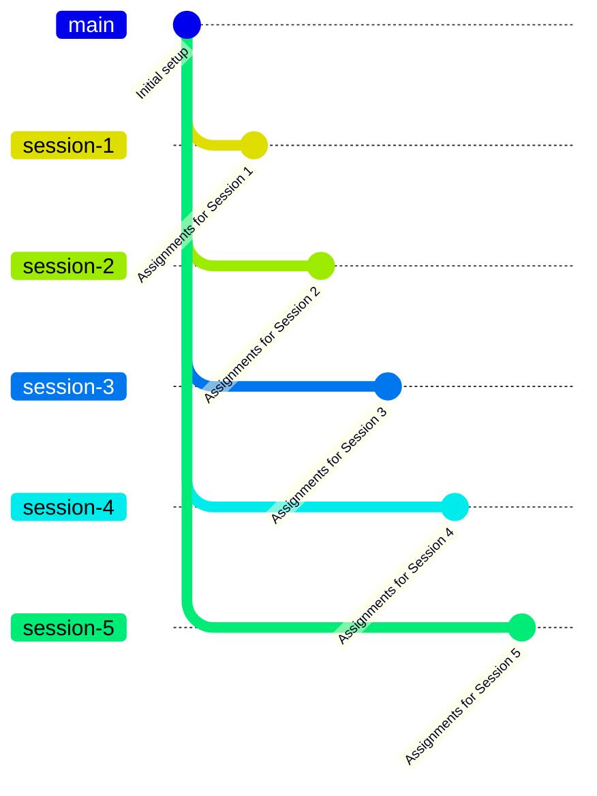

# Teaching Assignments Repository 📚

Welcome to the **Teaching Assignments Repository**!  
This repository is designed to store and organize all assignments used for teaching purposes. Each session’s materials are managed through **separate branches**, making it easy to track progress, maintain version control, and revisit past sessions.

---

## 📂 Repository Structure

- **Main Branch (`main`)**  
  Contains general documentation, guidelines, and setup instructions.

- **Session Branches**  
  Each branch corresponds to a specific teaching session:
  - `session-1` → Assignments for Session 1
  - `session-2` → Assignments for Session 2
  - `session-3` → Assignments for Session 3
  - `session-4` → Assignments for Session 4
  - `session-5` → Assignments for Session 5

---

## 🔀 Branching Workflow

